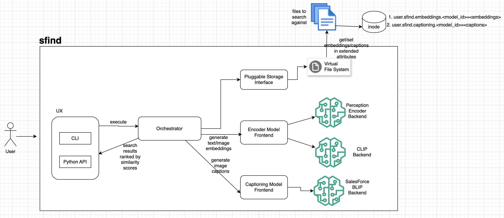

# sfind 🕵️‍♂️

**Tagline:** find, but semantic.

[](https://www.python.org/)
[](LICENSE)
[](https://pypi.org/project/sfind/)
[](https://github.com/furqan-shaikh/sfind)

---

## 🚀 What is sfind?

Stop searching by filenames. **sfind** lets you search your filesystem by **meaning and content**. Describe what you want — sfind finds it.  

- 🔹 **Semantic search** using AI models like **Perception Encoder** & **CLIP**  
- 🔹 **Filesystem as a vector store**: embeddings stored in file inodes (as extended attributes)  
- 🔹 **Explainable image results**: captions for image files  
- 🔹 **Privacy Focused**: Offline and local as no data is sent to cloud
- 🔹 **CLI interface** with ranked results

---

## ⚡ Quick Start

```bash
git clone https://github.com/furqan-shaikh/sfind.git
cd sfind
pip install -e .
```

## Search example
`sfind --query "novak djokovic playing tennis" --path /path/to/files --file_type i --explain true --limit 3`

Results for query: novak djokovic playing tennis

| # | File                 | Score | Caption                                    |
|---|----------------------|-------|--------------------------------------------|
| 1 | /path/to/image1.jpg  | 0.311 | a tennis player in action on a green court |
| 2 | /path/to/image2.jpeg | 0.310 | tennis player playing on hard court        |
| 3 | /path/to/image3.png  | 0.186 | a tennis court                             |

## 🧭 CLI Usage
NAME

sfind – semantic file finder

SYNOPSIS

sfind [QUERY] [OPTIONS]

DESCRIPTION

sfind performs semantic search over your local filesystem.
It encodes file contents (text or images) using pluggable models such as
Meta’s Perception Encoder or OpenAI’s CLIP, and stores their embeddings
directly in the file’s extended attributes.
This effectively turns your filesystem into a local vector store.

OPTIONS

--query  
    Text query to search against

--path  
    Path to search against

--file_type
Types of files to search. Valid values as of now are: i 

--limit <N>  
    Maximum number of results to display (default: 10).

--explain <true|false>  
    Generate captions for image results (default: false).


## 🔧 How it works
 - Embedding generation: files are encoded into vectors by your chosen model.
 - Stored in filesystem: embeddings saved as extended attributes (xattrs) in the inode.
 - Query & rank: semantic query matched against stored embeddings.
 - Explainable captions: images get a caption describing why they match.

## 🤖 Supported Models

| Name                      | Type             | Description                                                                  | Model ID            | Size |
|---------------------------|------------------|------------------------------------------------------------------------------|------------------|------|
| Meta's Perception Encoder | Vision Encoder   | Family of the state-of-the-art vision encoders for encoding images and video | PE-Core-L14-336  | 2.68 GB
| CLIP                      | Vision Encoder   | OpenAI's versatile embeddings for visual & textual data                      | openai/clip-vit-base-patch32 | 605 MB
| SalesForce BLIP           | Captioning Model | Salesforce’s BLIP (Bootstrapping Language-Image Pre-training) model                                 | Salesforce/blip-image-captioning-base   | 990 MB

## 🧠 Understanding Search Results
`sfind` uses semantic embeddings — it looks for meaning, not keywords.
Instead of matching exact words, it compares the concepts in your query and files using AI models like Perception Encoder or CLIP.

This means:
 - You might see results that are loosely related but not exact matches.
 - For example, searching for “Novak Djokovic playing tennis” might return a tennis photo at the top, but also some unrelated image lower down — because the model found visual or structural similarities (like layout, texture, or color patterns).
 - These results aren’t random; they’re the model’s best semantic guesses.


## 💡Tip for Better Queries

- Use descriptive phrases instead of single words.
    - ✅ "tennis player hitting a backhand"
    - ❌ "tennis"
- Include context when possible.
    - ✅ "cat sleeping on a sofa in sunlight"
    - ❌ "cat"
The more specific your query, the higher the chance the top results match your intent.

## Design


### Encoder Models
`sfind` provides 2 encoder models : Perception Encoder and CLIP.

#### Perception Encoder
- Family of pretrained models by Meta for images and text.
- Converts images or text into 1024-dimensional embeddings.
- Embeddings are unit-normalized, so dot product ≈ cosine similarity.

## 📜 License
MIT License


